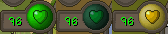

The Poison plugin displays an infobox with the current amount of poison/venom damage, recolors your HP heart sprite according to your poison type, and displays a tooltip when hovering your HP orb with poison information.

  

## Settings

### Show Infoboxes

Configures whether to show the infoboxes

### Change HP Orb Icon

Configures whether the hp orb icon should change color to match poison/disease
