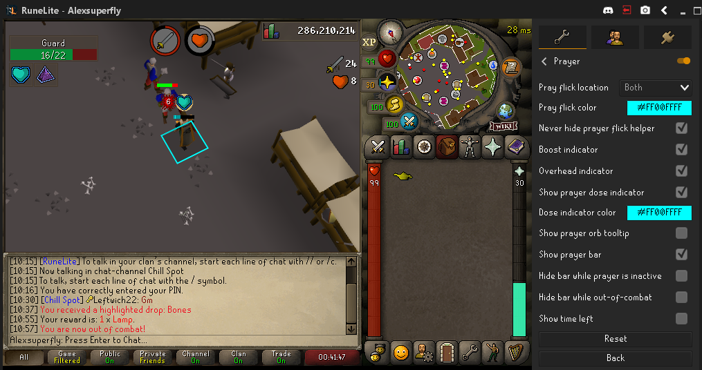
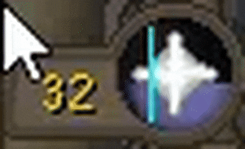

# Prayer Configuration

When enabled, this plugin will draw a moving line across your quick prayers icon in time with game ticks  
To flick accurately, double click your quick prayer icon (or a single prayer) _when the bar "resets"_  
 
For more information on prayer flicking, check the [OSRS Wiki](https://oldschool.runescape.wiki/w/Prayer#Prayer_flicking)
