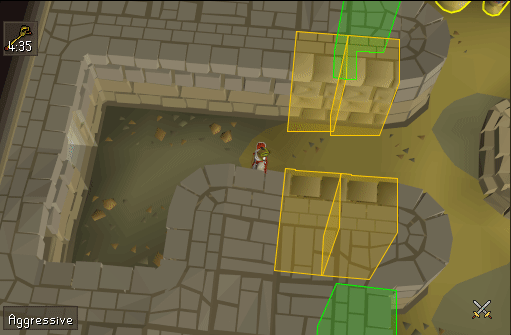

## Pyramid Plunder Plugin Configuration
Shows a custom overlay for Pyramid Plunder

## Settings
### Hide default timer
Hides the default pyramid plunder timer

### Show exact timer
Displays the amount of time remaining as an infobox

### Timer low warning
Determines the time when the timers color will change

### Highlight doors color
Selects the color for highlighting tomb doors

### Highlight doors
Highlights the four tomb doors in each room

### Highlight speartrap color
Selects the color for highlighting speartraps

### Highlight speartraps
Highlight the spear traps at the entrance of each room

### Highlight containers color
Displays the amount of time remaining as an infobox

### Highlight urns floor
Highlight the urns starting at selected floor and up

### Highlight chest floor
Highlight the Grand Gold Chest starting at selected floor and up

### Highlight sarcophagus floor
Highlight the sarcophagus starting at selected floor and up
