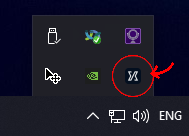

# Remove Java Memory Limit

If you are experiencing frame drops or client freezes, it may be due to a system-wide setting that restricts memory usage for all Java processes, including RuneLite.

To remove this limit, search for `env` in the start menu and click on `Edit the system environment variables`. 
If your system language is not English, the option may have a different name.

In the window that pops up, click on the `Environment Variables...` button in the lower right corner:

Finally, in the window that pops up, look at the top list for `User variables`, and see if you have a variable called `_JAVA_OPTIONS`.
If you see this variable with a value of `-Xmx256M`, click on it to select it, then click the `Delete` button, and afterwards click on `Ok`.

After `_JAVA_OPTIONS` has been deleted, you need to restart RuneLite for the change to take effect.
If you are using the Jagex launcher, make sure to exit out of it in the system tray,
otherwise RuneLite may inherit this environment variable from the already running Jagex launcher.
Another alternative is to restart your computer.

## My `_JAVA_OPTIONS` variable has a different value

Depending on the value of this option, it may or may not restrict memory for RuneLite.
A value including `-Xmx256M` means that any Java process on your system will be restricted to 256 MB,
which is too little for RuneLite to function in some areas of the game, such as Tombs of Amascut.
If your `_JAVA_OPTIONS` variable has a different value,
feel free to join the [RuneLite Discord](https://runelite.net/discord) and ask about it in the support channel.
