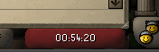

## Report Button Configuration

## Settings
### Display Options

You can switch between the following options:

`OFF:`
 The default report button  
`LOGIN TIMER:`
 Shows the time online since login   
`UTC TIME:`
 Shows the standard UTC (Coordinated Universal Time) time   
`JAGEX HQ TIME:`
 Shows the time at Jagex HQ (currently GMT)   
`LOCAL TIME:`
 Shows your local time
