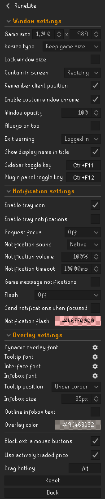

# RuneLite Configuration

## Window Settings

### Game size

Allows you to resize your client.

### Resize type

The way the game should open and close the sidebar.

### Lock Window Size

Don't allow window to resize.

### Contain in screen

Makes the client stay contained in the screen when attempted to move out of it.

### Remember client position

Save the position and size of the client after exiting.

### Enable custom window chrome

Whether or not Runelite should use custom title and border.

### Enable client always on top

The client will stay visible in front of other windows.

### Display warning on exit

A confirmation box will prevent you from accidentally closing the client. Can be configured to only apply when logged in.

### Show display name in title

Show display name of last logged-in account in the title bar.

### Sidebar Toggle Key

The key that will toggle the sidebar. Accepts modifiers.

### Plugin Panel Toggle Key

The key that will toggle the current or last opened plugin panel. Accepts modifiers.

## Notification Settings

### Enable tray notifications

Enables tray notifications.

### Request focus on notification

Configures the window request type on notification.
* **Request:** Requests user attention. Brings window to the front (Windows); Bounces RuneLite dock icon (MacOS).
* **Force:** Forces window to the front.

### Notification sound

Determines what sound to use for system notifications triggered by RuneLite.

* **Native:** Use default system notification sound
* **Custom:** The custom notification sound can be placed in `%userprofile%\.runelite` on Windows or `~/.runelite/` on Linux/MacOS. The notification must be called `notification.wav` and be in .wav format.

Additional custom notification sounds can be place in the associated `.runelite/notifications/` directory. These sounds must be in .wav format and will appear in the dropdown as the name of the sound file.

### Enable game message notifications

Notifications will put a message in the chatbox.

### Flash notification

Flashes the gameframe when a notification is triggered.

### Send notifications when focused

Toggles whether to send notification if you have the client focused.

### Notification Flash Color

Sets the color of the notification flashes.

## Overlay Settings

### Dynamic Overlay Font

Choose which font type to use for in-game overlays such as player names, ground items, etc.

### Tooltip Font

Choose which font type is used for in-game tooltips such as food stats and NPC names.

### Interface overlay font

Choose which font type is used for in-game interface overlays such as opponent info, clue scrolls etc.

### Require shift for overlay menu

Require shift to be held down to access overlay right-click menus.

### Tooltip Position

Configures whether to show the tooltip above or below the cursor.

### Display infoboxes vertically

Stack infoboxes vertically instead of horizontally.

### Infobox size(px)

Configures the size of infoboxes in pixels.

### Overlay Color

Configures the background color of infoboxes and overlays.

## Other

### Block Extra Mouse Buttons

Blocks extra mouse buttons (4 and above).
