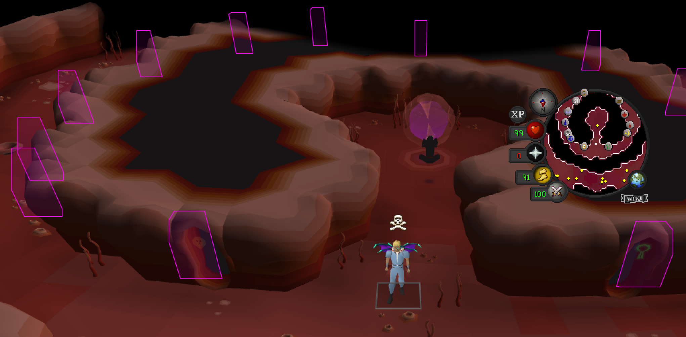
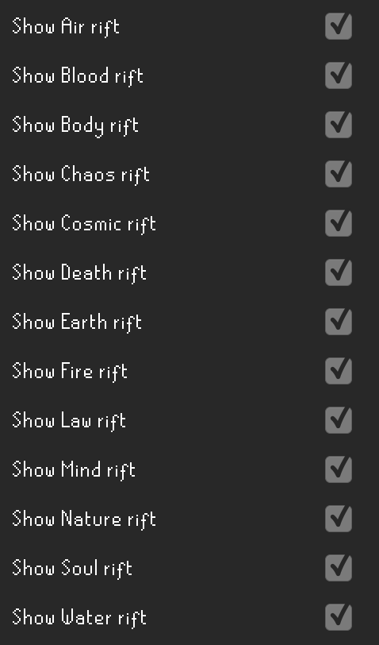

# Runecraft Configuration

Displays minimap icons and click boxes for abyssal rift and provides other Runecraft-related features.

## Settings

### Highlight Dark Mage NPC

Configures whether to highlight the Dark Mage for when pouches are degraded.

### Notify when pouch degrades

Send a notification when a pouch degrades

## Rift Settings

### Show Rifts in Abyss

Configures whether the rifts in the abyss will be displayed.

### Show Rift click box

Configures whether to show the click box of the rift in the Abyss.

### Show rift

Configures whether to display each rift in the Abyss.

