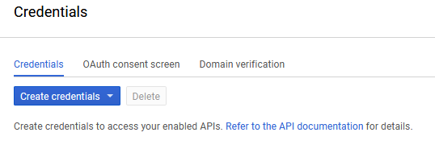
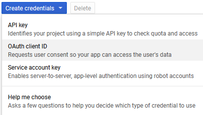
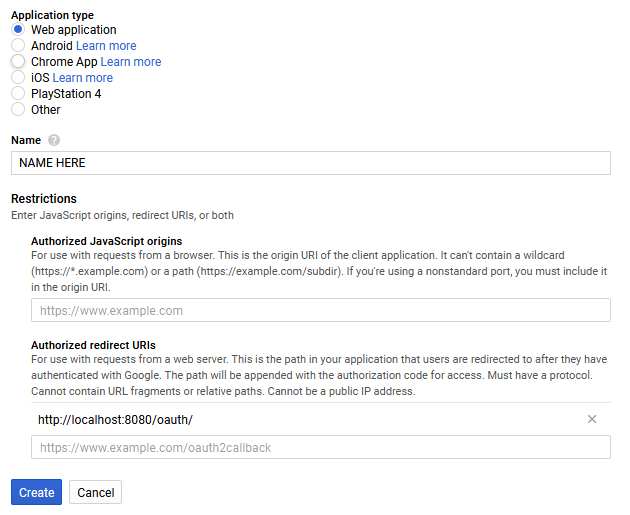
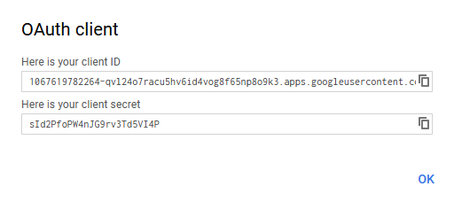

# Why would I want to do this?

In order to work on the Runelite HTTP API and Service you're going to want to run a local copy on your machine so you can test the changes you make.

# Setting up local environment

See [runelite-ansible](https://github.com/deathbeam/runelite-ansible)

# Setting up OAuth support

In order to login to the client while using the local API you will need to create OAuth 2.0 credentials, add them to your Tomcat config, build and deploy the RuneLite OAuth Servlet, and update the http-service OAuth redirect url to reference localhost instead of runelite.net.

### Creating OAuth 2.0 Credentials

Before we go any further we are going to create Google API credentials. See [Setting up OAuth 2.0](https://support.google.com/googleapi/answer/6158849) or [Using OAuth 2.0 to Access Google APIs](https://developers.google.com/identity/protocols/OAuth2) for more information about OAuth 2.0.

Step 1) Visit https://console.cloud.google.com/apis/credentials and click the create credentials button



Step 2) Select the OAuth client ID option



Step 3) Select Web Application and add `http://localhost:8080/oauth/` as a Redirect URI



Step 4) Create the credentials and copy the Client ID and Secret



### Adding OAuth Credentials to Config

Just add

```
-Doauth.client-id=1067619782264-qv124o7racu5v6id4vog8f65np8o9k3.apps.googleusercontent.com
-Doauth.client-secret=sId2PfoPW4nJG9rv3Td5VI4P
```

to your JVM parameters in IntelliJ.

You should now be able to login to the client while running the local API.

