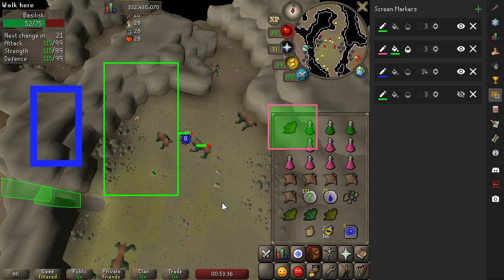
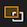
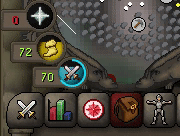
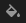
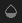
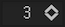
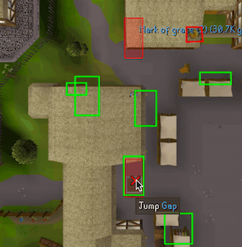
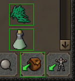
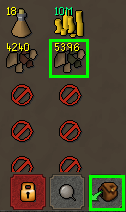
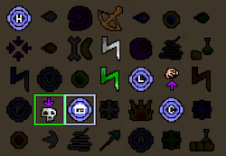

# Screen Markers Configuration

`Screen Markers` allows you to draw boxes on top of your RuneLite client.

This can be useful in setting up runs/tasks where it is beneficial to know the precise location of items, objects, or UI elements.

## Using Screen Markers

1. Open the  tab and click  to create a new marker.
2. `Screen Markers` can be placed on UI elements directly or drawn manually on the game window with click and drag.

    

3. To move a marker, hold `Alt` and drag.
4. Click  to save, or  to cancel.

## Settings

 **Edit Border Color:**
Opens Color Selections in a new window to change `Border Color` of selected marker.

 **Edit Fill Color:**
Opens Color Selections in a new window to change `Fill Color` of selected marker.

 **Toggle Background Transparency:**
Fills in the box with the selected `Fill Color` from `Edit Fill Color` section.

 **Thickness:** Changes the thickness of the border.

 **Show/Hide Screen Marker:** Toggles selected marker visibility.

## Examples
### Agility

### Bank Standing Skills

### Blast Furnace

### Spell Highlighting

