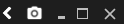
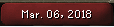

# Screenshot Configuration

Enables the screenshot button. The screenshot folder can be accessed by right clicking the screenshot button.

The default screenshot folder on Windows is: `C:\Users\*username*\.runelite\screenshots\`

The default screenshot folder on MacOS is: `/Users/*username*/.runelite/screenshots/`

## Settings

### Include Client Frame
If selected, the screenshot will include the entire client, with sidebar and title bar.
If deselected, the screenshot will only include the game window.

### Display Date
Configures whether the report button will be changed to the current date when taking a screenshot.

### Notify When Taken
RuneLite will send a system notification when a screenshot is taken.

### Upload

Configures whether or not screenshots are uploaded to Imgur, or placed on your clipboard.

### Screenshot hotkey

When you press this key a screenshot will be taken.

## What to Screenshot

### Screenshot Rewards

Configures whether screenshots are taken of clue rewards, barrows chests, raid rewards, and quest completions.

### Screenshot Levels

Configures whether screenshots are taken of level ups.

### Screenshot Kingdom Reward

Configures whether screenshots are taken of your Kingdom Reward.

### Screenshot Pet

Configures whether screenshots are taken of receiving pets.

### Screenshot PvP Kills

Configures whether or not screenshots are automatically taken of PvP kills.

### Screenshot Boss Kills

Configures whether or not screenshots are automatically taken of boss kills.

### Screenshot Deaths

Configures whether or not screenshots are automatically taken when you die.

### Screenshot Friend Deaths

Configures whether or not screenshots are automatically taken when nearby friends or clan members die.

### Screenshot Duels

Configures whether or not screenshots are automatically taken of the duel end screen.

### Screenshot Valuable Drops

Configures whether or not screenshots are automatically taken when you receive a valuable drop.

### Screenshot Untradeable Drops

Configures whether or not screenshots are automatically taken when you receive an untradeable drop.

### Screenshot Kicks from CC

Take a screenshot when you kick a user from a clan chat.
