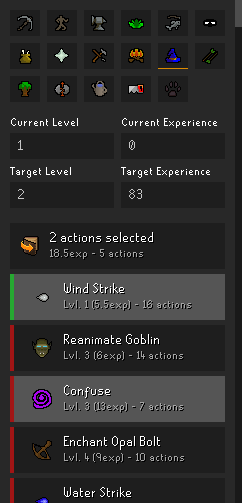

The Skill Calculator plugin adds a sidebar panel which lists all skills along with "Current" and "Target" level dialogs. After selecting a skill and entering the desired level and experience amounts, selecting skill actions will indicate how many times the selected actions will need to be completed to achieve the desired target.

