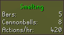

# Smelting Configuration
Display an infobox with stats for the current smelting session.

## Settings
### 1. Reset stats (minutes) [Edit Box]
(Default 5) This configurable time frame allows the user to choose how long of inactivity of smelting it takes to remove the Smelting Infobox.
