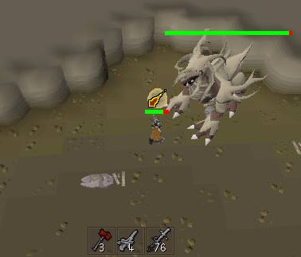

# Special Attack Counter Configuration

This plugin will track the following special attacks used on any NPC:

* Dragon Warhammer - hits
* Arclight - hits
* Darklight - hits
* Bandos Godsword - damage

The counter will reset if the player attacks a different NPC or if the NPC dies.

You can share your special attack counter with your party. See [Party plugin](https://github.com/runelite/runelite/wiki/Party).
