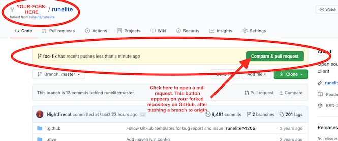
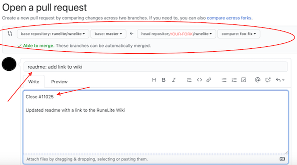
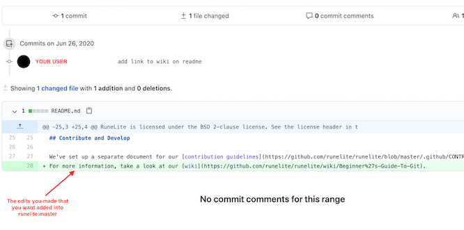
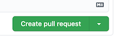

To do this, navigate to your forked repository on GitHub (i.e. github.com/youruserhere/runelite).
- *note: if you're already confused see [here](https://github.com/runelite/runelite/wiki/Beginner%27s-Guide-To-Git). This will walk you through forking your own repository of runelite, creating a branch, making edits, and eventually uploading that branch to the web (GitHub).*

You should see something like this:


- notice that in this example, the user has pushed a feature branch called 'foo-fix' to their forked repository on GitHub.
- to begin the process of merging this feature branch into the original runelite repository (runelite:master), click the green button to open a pull request.

---

- double check that you are merging your branch (i.e. 'foo-fix') from your forked repository into runelite:master
- use a short and clear title that briefly explains what you did. A good format is something like: "plugin: your fix here".
  * *Remember: Commit messages should use present-tense imperative verbs. (e.g. "change x to y", not "changed x to y").*
- if applicable, link the issue that you worked on (i.e. Close #12345)
- use the text box to further explain your edits

---

- double check that the edits you are submitting are the ones that you expect.
- GitHub creates a nice visual display of the text edits that you did, files modified, files added, etc.

---

- click this button (bottom right-hand corner of text box) to submit your pull request and have someone review your work.

---
**If someone requests you to make changes**, then:
- make the required updates
- re-run runelite and make sure any and all tests are still passing
- commit your changes to your branch (e.g. foo-fix)
- push changes to yout GitHub repository (origin). This will automatically update your pull request.

If the PR get too outdated, rebase and force push to update it:
```
git fetch upstream
git rebase upstream/master
git push origin my-fix-branch -f
```

**After your pull request is merged**

After your pull request is merged, you can safely delete your branch and pull the changes from the main (upstream) repository:

- Delete the remote branch on GitHub either through the GitHub web UI or your local shell:
`git push origin --delete foo-fix`
- checkout the master branch:
`git checkout master -f`
- delete the local branch:
`git branch -D foo-fix`
- update your master with the latest upstream:
`git pull --ff upstream master`

*Helpful Links*
- [Contribution Guidelines](https://github.com/runelite/runelite/blob/master/.github/CONTRIBUTING.md#submit)
- [Git Cheat Sheet](https://github.com/runelite/runelite/wiki/Git-Cheat-Sheet)
- [Beginner's Guide to Git](https://github.com/runelite/runelite/wiki/Beginner%27s-Guide-To-Git)
