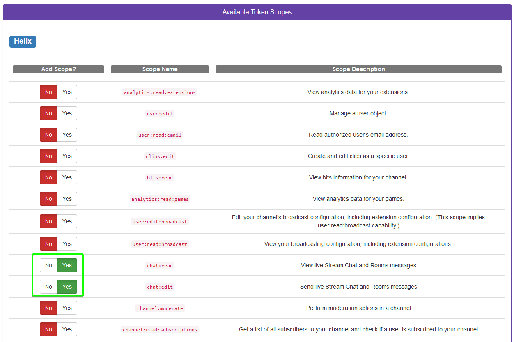

# Twitch

The Twitch plugin allows you to view twitch chat and send messages from RuneLite.

## Usage

Messages will show up as a clan chat message, allowing you to filter them as you would regular clan chat messages. Messages can be sent to the channel by prefixing with `/t `. 

For example:
```
/t hi twitch
```

## Settings

### Username

Your Twitch username

### OAuth Token

Used to authenticate with Twitch, can be generated by using https://twitchtokengenerator.com/

Click the `Custom Scope Token` option  
  

Scroll down and check toggle `chat:read` and `chat:edit` to `Yes`.
  

Scroll down and click `Generate Token!`
  

Once you've completed the login process, you'll be directed back to the main page:
  

Copy the `ACCESS TOKEN` and paste it into the `Oauth Token` box in RuneLite.


### Channel

The username of the channel you want to view the chat of.
