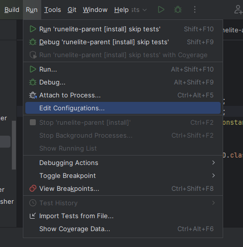
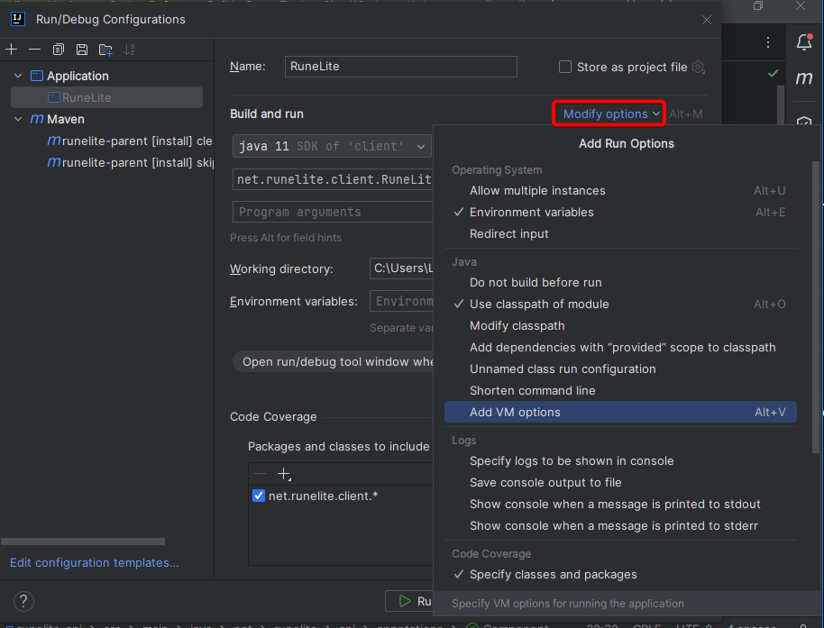
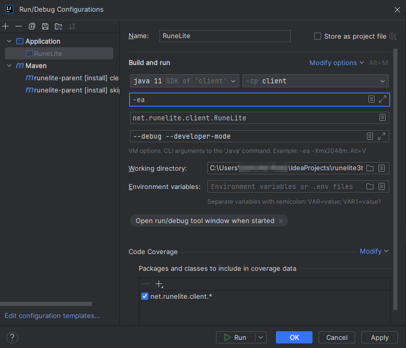

###  Turning the developer tools on

To turn the developer tools on, we need to supply the program argument `--developer-mode` and the VM arguments `-ea`.

It is also recommended to add `--debug` to your program arguments to get extra logging output.

To do this in IntelliJ, you'll need to edit your run configuration:

You'll also need to click `Add VM options` to be given the the VM arguments box, to input `-ea`.

Specify the settings as follows:

