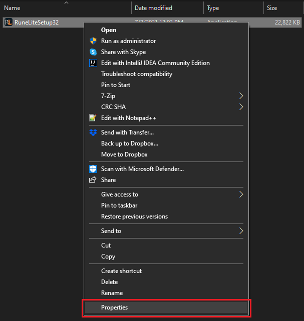
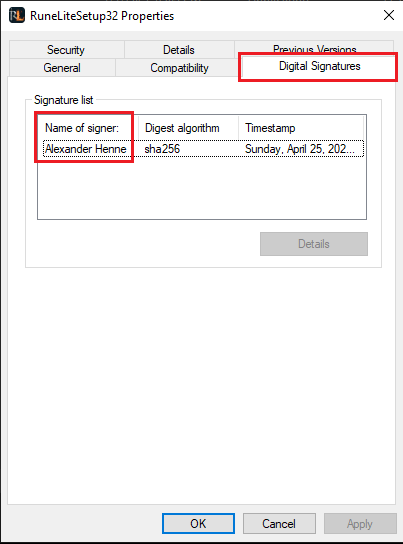

Googling `RuneLite` can be unsafe since Google can return (multiple) phishing
sites instead of the authentic site https://runelite.net. If you have already
downloaded the launcher, such as `RuneLiteSetup32.exe` or `RuneLiteSetup.exe`,
you can verify its authenticity by doing the following:

# Windows

## Verifying executable signature

Right click `RuneLiteSetup32.exe` or `RuneLiteSetup.exe` and click `Properties`

Click `Digital signatures` and verify that `Name of signer` is `Alexander Henne` or `Thomas Alexander Henne`

