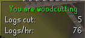
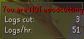

## Woodcutting Plugin Configuration  
Enables tracking your Woodcutting statistics  
The plugin will show whether or not you are woodcutting, your total logs cut, and your logs cut per hour  

  

## Settings
### Reset stats (minutes)
The amount of time after your last log cut that the infobox will wait to disappear  

### Bird nest notification
If enabled, the plugin will send you a system tray notification when a bird nest appears
