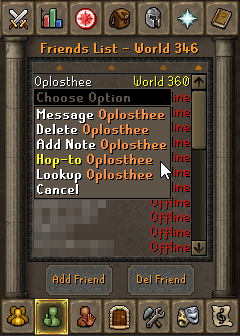
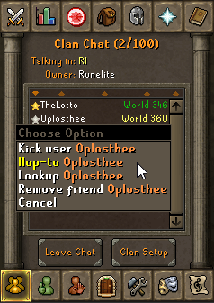
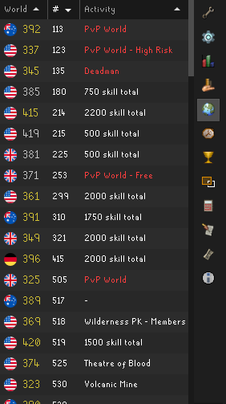

The World Hopper plugin adds a sidebar panel listing all the Oldschool Runescape worlds, their regions, their activities, and their populations. Double-clicking any of the world entries will trigger a world hop to that world. In addition, this plugin adds a "Hop-to" menu option to the Friend's List and Clan Chat for players on other worlds. It also adds quick-hop shortcuts to hop to the next and previous worlds in the world list.

## Settings

### Quick-hop previous

When you press this key you'll hop to the previous world

### Quick-hop next

When you press this key you'll hop to the next world

### Quick-hop out of dangerous worlds

Toggles whether to hop to a PVP/high risk world when quick-hopping

### Show world hopper sidebar

Toggles whether the world hopper panel should be added to the sidebar

### Quick-hop Chat Command

`::hop <world-number>` can be typed into the games chatbox to hop to the specified world (e.g. `::hop 321` to hop to world 321)
>>>>>>> upstream/master
