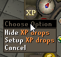
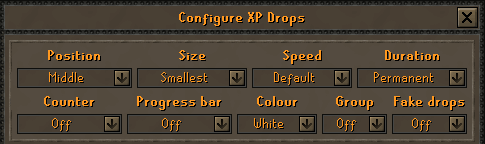
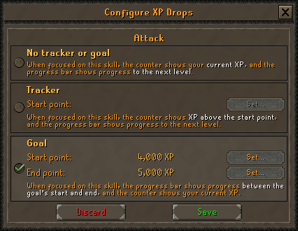
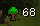
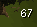

## XP Drop Configuration

Allows you to customize the way XP drops are displayed. RuneLite is using vanilla experience drops, so make sure to enable it here:

Here is example configuration to hide the side tracker and position experience drops in middle:

## Goals
Goals are also configured using the vanilla interface

 
## Settings
---
### Hide skill icons
Toggles skill icons displaying next to the amount of XP earned.
(Disabled) 

(Enabled) 

## Combat Prayer Colors
Enables users to change xp drop colors for combat skills affected by prayer boosts.
