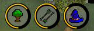
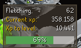
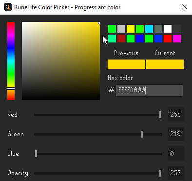
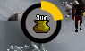
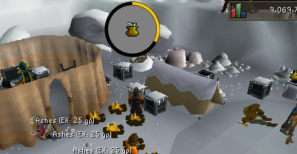

## XP Globes Configuration
Configures whether to show XP globes for the respective skill when XP is gained  

## Warning
The XP Tracker plugin **must** be enabled in order for XP Globes to work. If XP Globes is not working as intended, please check your list of enabled plugins to ensure that XP Tracker is enabled before submitting a bug report.

## Settings
### Enable Tooltips
Shows a detailed tooltip with level, current XP, and XP to level when hovering on a globe  
	XP Left, Actions left, and XP/hr can bo toggled on or off for display in the tooltip

### Progress colors
The XP globe colors can be fully customized with the 3 options given: arc color, outline color, background color
  

### Progress arc width
Changes the thickness of the arc in the XP globe  

### Size of orbs
Resizes the XP globes (lower value is smaller)  

### Center orbs
Chooses where to center the XP globes  
Current options are `MIDDLE_CANVAS`, `MIDDLE_VIEWPORT`, and `DYNAMIC`
