# XP Tracker Configuration

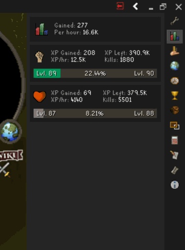

When open, this panel can display the following information about each skill in which you have gained XP this session, including:
* Time to Level
* Total XP gained
* XP per hour
* XP remaining
* Actions left
* Actions per hour
* Actions completed

Additionally, you are able to right click your Overall Gained XP or each skill individually for some additional options:

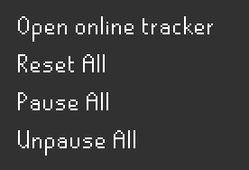
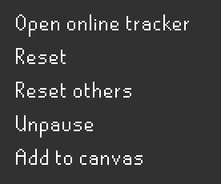

## Settings

### Hide maxed skills

Stop globes from showing up for level 99 skills.

### Pause on Logout

Configures whether skills should pause on logout.

### Show intermediate level markers

Marks intermediate levels on the progress bar.

### Auto pause after

Pauses skills after a configured number of minutes without XP gain. 0 to disable.

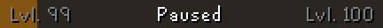

### XP Info labels

You can customize the XP tab to display any combination of information:

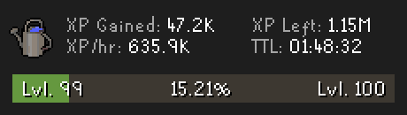

## Overlay

### Add skill tab canvas menu option

Configures whether a right-click menu option to show/hide canvas XP trackers will be added to skills on the skill tab.

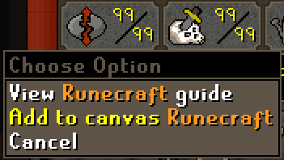

### On-screen tracker display mode

You can customize the on-screen XP tracker to display any combination of information:

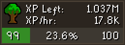

# Setting Level Goals

Level goals beyond the next level can be set by using the ingame XP/Level goals interface.

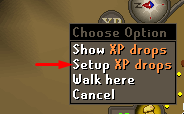 
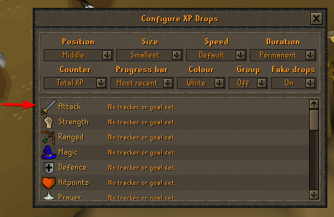
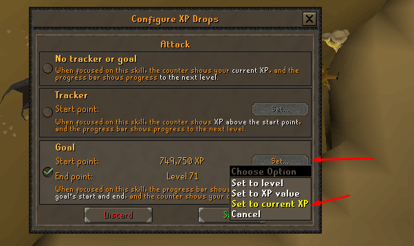
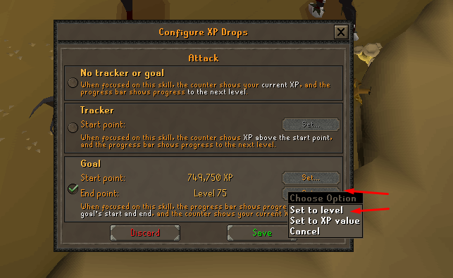
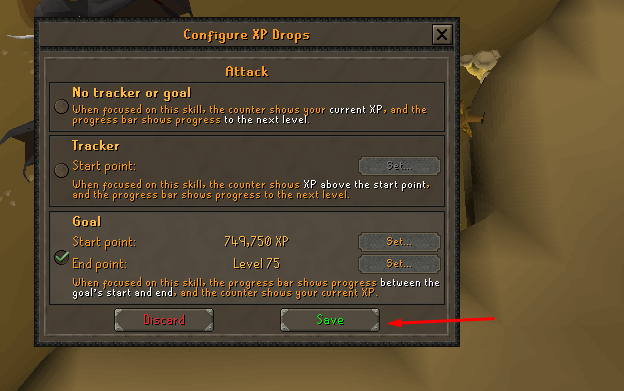
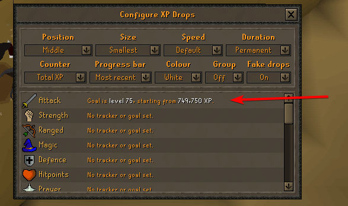

Once you have passed ingame level goals, the XP tracker will go back to displaying your progress toward the next level.
