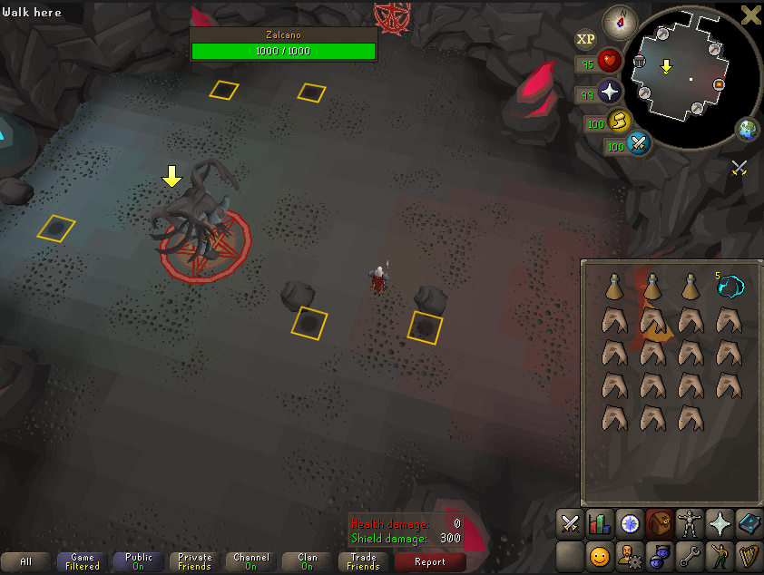
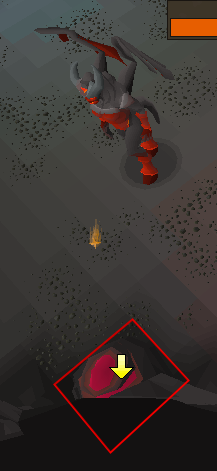
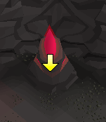

The Zalcano plugin offers a number of helpful overlays for the Zalcano boss:

- Glowing rock hint arrows
- Weakened Zalcano hint arrow
- Falling rock tile highlights
- Highlights on glowing rocks attacked by Zalcano

